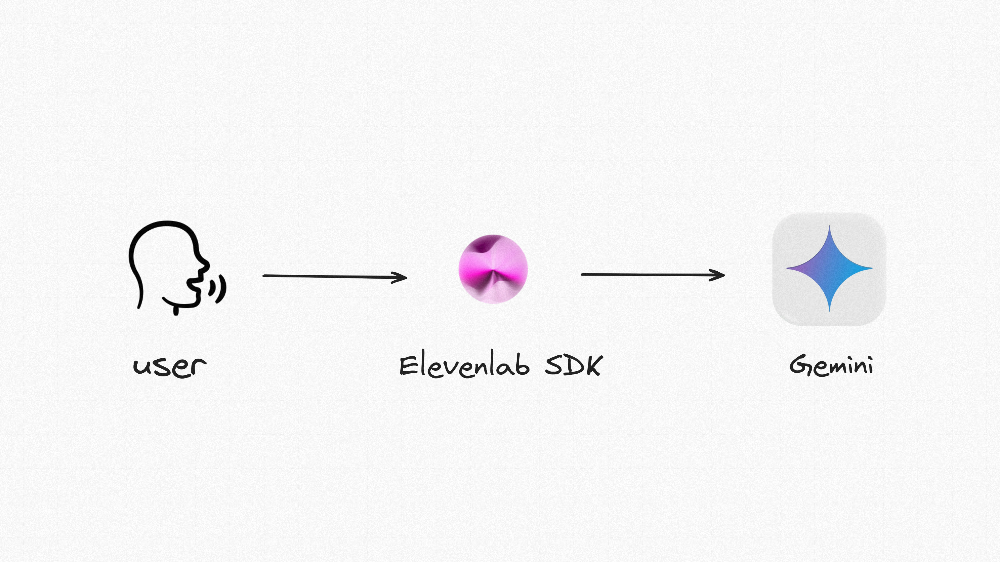

<a href="https://github.com/Md-Zainulabdin/pwa-conversational-ai">
  
  <br>
  <br>
  <h1>pwa-conversational-ai</h1>
</a>

<p>
  A Progressive Web App (PWA) demonstrating conversational AI with ElevenLabs, Gemini, and Next.js, enabling voice interaction and dynamic responses.
</p>

<p>
  <a href="#features"><strong>Features</strong></a> ·
  <a href="#tech-stack"><strong>Tech Stack</strong></a> ·
  <a href="#code-overview"><strong>Code Overview</strong></a> ·
  <a href="#deploy-your-own"><strong>Deploy Your Own</strong></a> ·
  <a href="#running-locally"><strong>Running Locally</strong></a>
</p>

## Features

- **[Next.js](https://nextjs.org)** for creating a fast, scalable, and installable PWA
  - Server-side rendering and seamless routing
  - Progressive Web App (PWA) capabilities for installation on any device
- **[ElevenLabs React SDK](https://elevenlabs.io)** for lifelike voice AI
  - Voice recognition and text-to-speech functionality
  - Dynamic, human-like voice interactions
- **Gemini AI** for powerful natural language understanding and responses
  - Real-time, context-aware conversational AI
- **TailwindCSS** for modern and responsive styling
- **Shadcn UI** for accessible and polished component design

## Tech Stack

- **Framework:** [Next.js](https://nextjs.org)
- **UI:** [TailwindCSS](https://tailwindcss.com), [Shadcn UI](https://ui.shadcn.com)
- **AI SDKs:** [ElevenLabs React SDK](https://elevenlabs.io), [Gemini AI](https://gemini.google)
- **Deployment:** [Vercel](https://vercel.com)

## Deploy Your Own

Launch your personalized FriendAI on Vercel with just one click:

[](https://vercel.com/new/clone?repository-url=https%3A%2F%2Fgithub.com%2FMd-Zainulabdin%2FFriendAI&env=ELEVENLABS_API_KEY,GEMINI_API_KEY&envDescription=Add%20your%20API%20keys%20here.&envLink=https%3A%2F%2Fdocs.friend-ai.com%2Fenv&demo-title=FriendAI&demo-description=A%20friendly,%20voice-driven%20AI%20assistant.&demo-url=https%3A%2F%2Ffriend-ai-demo.vercel.app&stores=[])

## Running Locally

To run the app locally, follow these steps:

1. Clone the repository:

   ```bash
   git clone https://github.com/Md-Zainulabdin/pwa-conversational-ai.git
   ```

2. Navigate to the project directory:

   ```bash
   cd pwa-conversational-ai
   ```

3. Create a `.env` file in the root directory and add your API keys:

   ```env
   ELEVENLABS_API_KEY="your-elevenlabs-api-key"
   GEMINI_API_KEY="your-gemini-api-key"
   ```

4. Install dependencies:

   ```bash
   bun install
   ```

5. Start the development server:

   ```bash
   bun run dev
   ```

Your app should now be running at `http://localhost:3000`.

---

Let me know if you have any additional questions or need further assistance!

